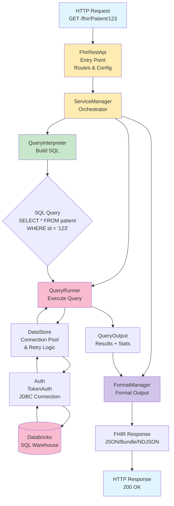
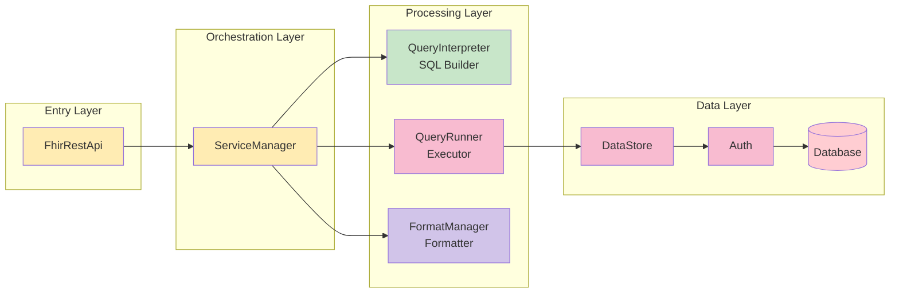
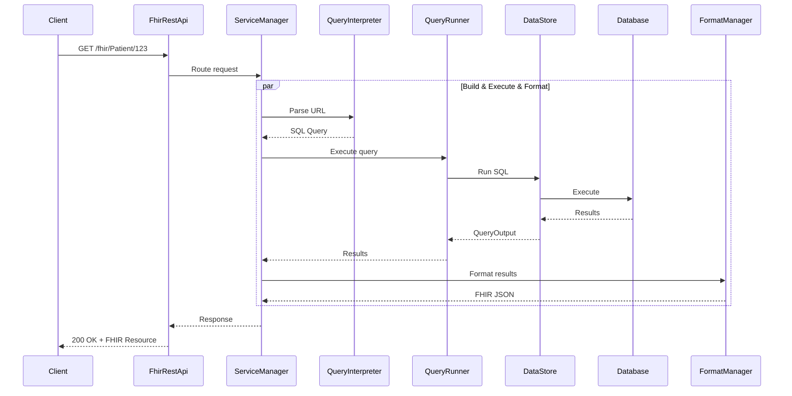

# FHIR API - Simplified Architecture

## Request Flow Diagram



## Component Overview



## Simplified Component Interaction



## Key Components (Simple View)

| Component | What It Does | Example |
|-----------|--------------|---------|
| **FhirRestApi** | Receives HTTP requests | `GET /fhir/Patient/123` → route to handler |
| **ServiceManager** | Coordinates everything | Calls Interpreter → Runner → Formatter |
| **QueryInterpreter** | URL → SQL | `/Patient/123` → `SELECT ... WHERE id='123'` |
| **QueryRunner** | Executes SQL | Runs query, returns results + stats |
| **DataStore** | Database connection | Connection pool + retry logic |
| **Auth** | Authentication | Token-based JDBC auth |
| **FormatManager** | SQL results → FHIR | JSON results → FHIR Bundle/Resource |

## Navigation Guide

### Where do I look for...?

| Question | File to Check |
|----------|---------------|
| "How do URLs become SQL queries?" | `QueryInterpreter.scala` |
| "How do queries run?" | `QueryRunner.scala` |
| "How do we connect to the database?" | `DataStore.scala` + `Auth.scala` |
| "How do results become FHIR format?" | `FormatManager.scala` |
| "What are all the API endpoints?" | `FhirRestApi.scala` |
| "How does it all fit together?" | `ServiceManager.scala` (START HERE!) |

## Request Example: Step by Step

### 1. Client Request
```http
GET /fhir/Patient/a62a41dc-5ac1-ff47-3fc5-08f6ad045571
```

### 2. FhirRestApi
- Routes to Patient handler
- Loads config

### 3. ServiceManager
- Calls `QueryInterpreter.read("Patient", "a62a41dc-5ac1...")`
- Gets SQL query back
- Passes to `QueryRunner`

### 4. QueryInterpreter
```scala
// Builds:
"SELECT to_json(patient) AS resultset 
 FROM hls_healthcare.databricks_fhir_service_forked.patient 
 WHERE id = 'a62a41dc-5ac1-ff47-3fc5-08f6ad045571'"
```

### 5. QueryRunner → DataStore
- Executes SQL via connection pool
- Returns `QueryOutput` with results + metadata

### 6. FormatManager
- Takes SQL results
- Formats as FHIR Resource (JSON)
- Adds proper status codes

### 7. Response
```json
{
  "id": "a62a41dc-5ac1-ff47-3fc5-08f6ad045571",
  "meta": {"profile": ["http://hl7.org/fhir..."]},
  "resourceType": "Patient",
  ...
}
```

---

## Architecture Principles

1. **Separation of Concerns**: Each component has one job
2. **ServiceManager is the Hub**: Everything flows through it
3. **Three-Stage Pipeline**: Parse → Execute → Format
4. **Database Abstraction**: DataStore/Auth hide DB complexity
5. **FHIR Compliance**: FormatManager ensures spec compliance

